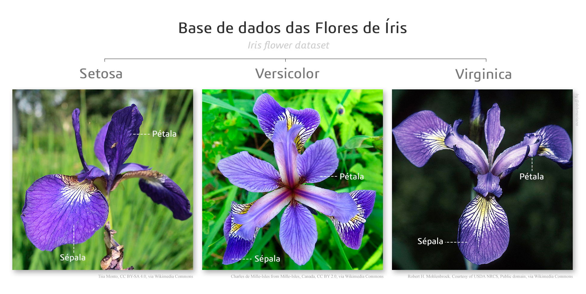

# Redes Neurais artificiais: Identificação de Iris

    

## Introdução

Redes neurais artificiais são modelos computacionais inspirados no funcionamento do cérebro humano. Elas são compostas por unidades interconectadas, conhecidas como neurônios artificiais, que trabalham juntas para realizar uma tarefa específica, como reconhecimento de padrões, classificação de dados ou previsão de valores.

As redes neurais artificiais são capazes de aprender a partir de exemplos, ajustando os pesos das conexões entre os neurônios para melhorar a precisão da saída. Esse processo de ajuste é chamado de treinamento da rede neural e pode ser supervisionado ou não supervisionado.

No treinamento supervisionado, a rede neural recebe exemplos de entrada, juntamente com as saídas corretas correspondentes, e ajusta seus pesos para minimizar o erro entre as saídas reais e as saídas desejadas. Já no treinamento não supervisionado, a rede neural é exposta apenas aos exemplos de entrada e deve descobrir padrões e estruturas por conta própria.

Uma das principais vantagens das redes neurais artificiais é sua capacidade de lidar com dados complexos e não lineares. Elas são capazes de lidar com informações de múltiplas fontes, como texto, imagem e som, e podem ser usadas em uma variedade de aplicações, como reconhecimento de fala, detecção de fraudes, diagnóstico médico e previsão de tendências.

No entanto, as redes neurais artificiais também têm algumas limitações. Elas podem ser computacionalmente intensivas e exigir grandes quantidades de dados para um treinamento adequado. Além disso, as redes neurais podem ser difíceis de interpretar, tornando difícil entender como e por que elas tomam determinadas decisões.

Apesar dessas limitações, as redes neurais artificiais continuam a ser uma área de pesquisa ativa e uma ferramenta poderosa para resolver problemas complexos em uma variedade de áreas. Com a crescente disponibilidade de dados e avanços na computação, as redes neurais artificiais estão se tornando cada vez mais importantes em nossa sociedade tecnologicamente avançada.

## Problema

Esse projeto tem como objetivo realizar uma classificação multiclasse de uma base de flores, temos 3 tipos de resultados possíveis que são: Íris Setosa, Íris virginica, Íris versicolor. Temos como base de treinamento um dataframe com 4 aspectos da flor e seus respectivos resultados. Com isso somos capazes de treinar a rede neural.

## Arquivos

Treinamento da rede neural com divisão da base entre treinamento e testes

    iris_simple.py

Treinamento da rede neural cruzada, onde todos os dados são treinados e testados

    iris_crusade.py

Treinamento para encontrar os melhores parâmetros

    iris_tuning.py

Salvando, carregando e testando a rede neural com um parâmetro externo 

    iris_salvar_carregar_classificar.py
